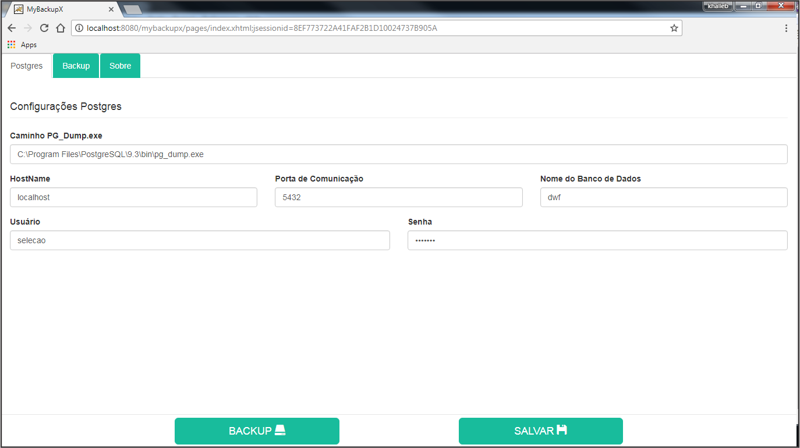
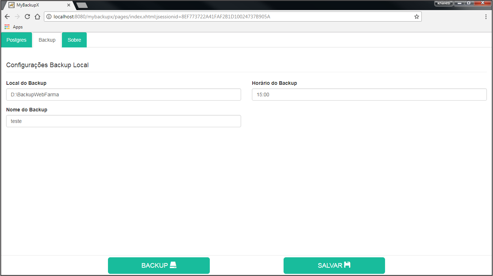

# MyBackupX - Backup para Postgres #
## Descrição do Projeto
Bem vindos ao MyBackuX, um programa desenvolvido na liguagem Java para auxiliar no backup de banco de dados do postgres.

## Pré-Requisitos ##
* Java 8
* TomCat7 ou superior

## Download  ##
Download do arquivo `WAR` [Aqui](/target/github-download-1.0-SNAPSHOT-jar-with-dependencies.jar)

## Uso ##
Inicializado a aplicação.

    http://localhost:8080/mybackupx/pages/index.xhtml

## Contribua com o Projeto ##
Para contribuir basta clicar no botão **Fork**, criar um *Branch*, arrumar o código e enviá-lo com um **Pull Request**.
Mais detalhes de como contribuir e enviar Pull Requests em [GitHub Collaborating](https://help.github.com/categories/63/articles).

[Como colaborar com projetos opensource com GitHub](http://www.youtube.com/watch?v=H3olaBo83As)

  
  

